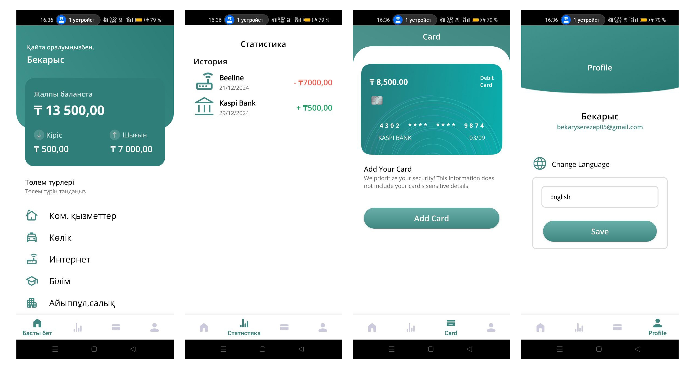

# Monty: Finance Navigator

## Project Overview
**Name**: Monty: Finance Navigator  
**Platform**: Android (Java)  
**Description**: A personal finance management app designed to help users track their expenses, manage their income, and maintain a record of financial transactions with no ads or subscriptions. The app focuses on simplicity, usability, and seamless financial tracking.  
**Objective**: Provide a smooth and efficient financial tracking experience with a clean and intuitive design.

You can view the full design in Figma [here](https://www.figma.com/design/0zXyNYLVgW1ihwBRY24U7T/monty-2.0?m=auto&t=de9cH5Lj1sT0BILv-1).

---

---

## Features
- **Home Screen**: Displays the total balance, categorized expenses, and a simple navigation menu for easy access to all sections of the app.
- **Statistics**: A transaction history list, categorized by type and date, giving a clear view of financial trends.
- **Expense Management**: Allows users to add, edit, and categorize expenses, with detailed inputs to capture all relevant information.
- **Card Management**: Supports adding and managing multiple bank cards or balance cards for a complete financial overview.
- **Profile Settings**: Users can update their details and customize their language preferences.
- **Onboarding**: A smooth onboarding process helps users set up the app quickly and start tracking their finances.

---

## Tech Stack
- **Programming Language**: Java
- **UI/UX Design**: XML layouts with Google icons and fonts for a modern, minimalistic design.
- **Libraries/Frameworks**: Android SDK
- **Design Tools**: XML for layouts, built-in Android Studio tools for UI, and Figma for UI design.

---

## Challenges Solved
- Designed a pixel-perfect user interface using XML layouts, ensuring responsiveness across different screen sizes and devices.
- Integrated Google icons and fonts to give the app a professional and cohesive look.
- Optimized app performance to provide a smooth experience even on lower-end devices.

---

## Future Enhancements
- **Graphical Visualizations**: Introduce charts and graphs for better financial analytics and tracking.
- **Recurring Expense Tracking**: Add support for setting up and tracking recurring expenses.
- **Cloud Sync and Backup**: Provide options for syncing data with cloud storage and backing up user data.

---

## UI/UX Design
The UI design was created using Figma to ensure a modern and user-friendly interface. The design emphasizes simplicity and ease of use, with a focus on financial tracking and clarity.

---

## System Requirements
- **Android version**: 5.0 (Lollipop) or higher
- **RAM**: Minimum 1 GB
- **Storage**: Approx. 20 MB of free space for installation

---

## How to Use
1. Launch the app after installation.
2. Follow the onboarding process to quickly set up your profile.
3. Start adding your financial transactions, categorize expenses, and manage your cards directly from the home screen.
4. Use the statistics section to view detailed reports of your spending habits.

---

## Contributing
Feel free to contribute to the project by forking the repository, making improvements, and submitting pull requests. Any contributions are welcome!

---
